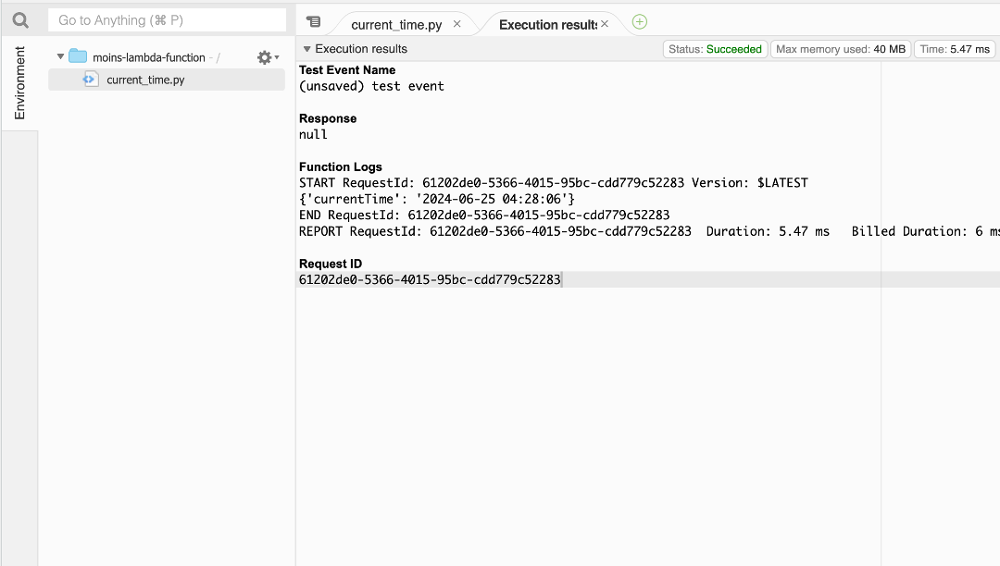

## AWS Lambda Function to Get Current Time



```bash
### GHA Workflow
├── Run Tests ──> Initialize Terraform ──> Refresh Terraform ──> Validate Terraform ──> Deploy Terraform
```

```bash
### Project Folder Structure
AWS_Lambda/
├── terraform/
│   ├── current_time.py
│   ├── lambda.tf
│   └── main.tf
├── .github/
│   └── workflows/
│       └── Terraform_deploy.yml/
├── README.md
├── LambdaResult.png
└── .gitignore
```

